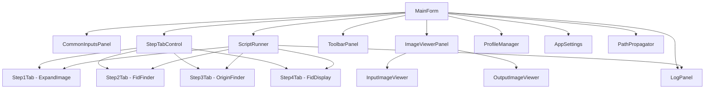
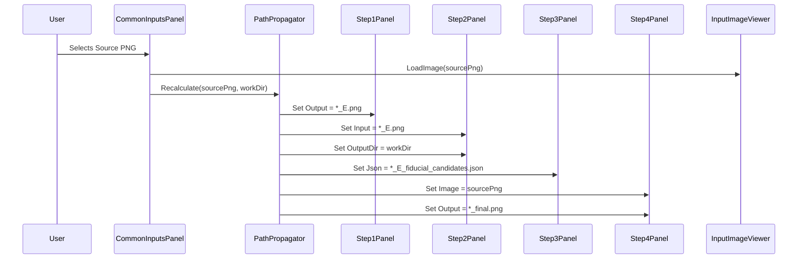
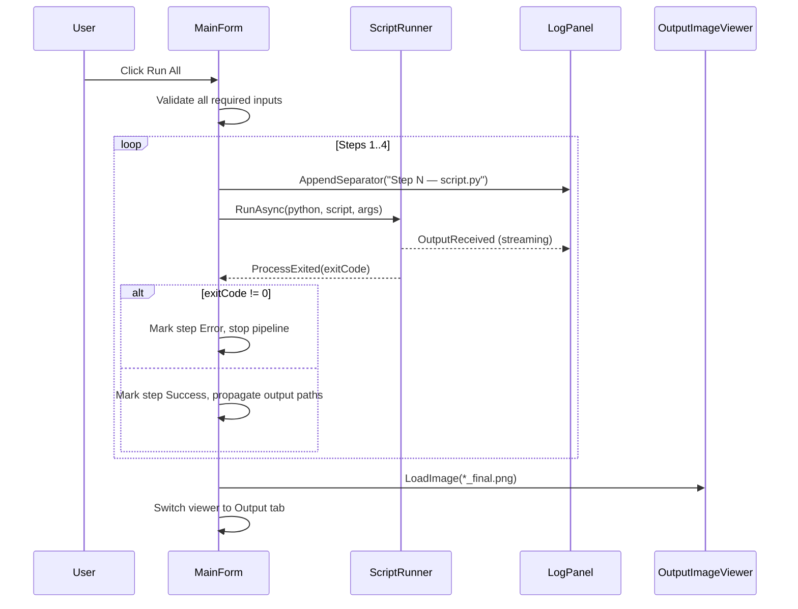

# PCBVisor Script Helper — Implementation Plan

> [!NOTE]
> This is a **design-only** document. No code will be generated until the user explicitly requests development to begin.

**Based on:** [PCBVisorScriptHelperApp.md](file:///C:/dev/projects/fid_finder/PCBVisorScriptHelperApp.md)  
**Target:** C# / WinForms / .NET 8  
**Build tool:** `dotnet` CLI  

---

## Goal

Build a Windows desktop GUI that wraps four Python scripts (`expand_image.py` → `fid_finder.py` → `origin_finder.py` → `fid_display.py`) into a single, user-friendly application. The app configures each script's CLI arguments through validated UI controls, runs them sequentially or individually, streams live output to an integrated log panel, and displays both the source PCB image and the final annotated result (`_final.png`) side-by-side in a two-tab image viewer.

---

## Confirmed Decisions

| # | Decision |
|---|----------|
| 1 | Output suffix for Step 4 is **`_final.png`** (single underscore). |
| 2 | C# project location: `C:\dev\projects\fid_finder\PCBVisorScriptHelper\`. |
| 3 | `FIDUCIAL_RADIUS_OFFSET_PX` is a script-level constant — **no UI spinner** for it in v1.0. |

## Open Questions

> [!IMPORTANT]
> **Python executable discovery:** The app will search `PATH` on startup. Should it also scan common virtual environment locations (e.g., `.venv\Scripts\python.exe` relative to the scripts directory)? Recommended: yes.

> [!IMPORTANT]
> **Profile auto-save on exit:** The requirement says "optionally save". Should this be controlled by a checkbox in Settings, or should it always auto-save? Recommended: a Settings checkbox, defaulting to ON.

---

## Proposed Changes

### Component Architecture



---

### Project Structure

```
PCBVisorScriptHelper/
├── PCBVisorScriptHelper.sln
└── PCBVisorScriptHelper/
    ├── PCBVisorScriptHelper.csproj          (.NET 8, WinForms)
    ├── Program.cs
    │
    ├── Forms/
    │   └── MainForm.cs / .Designer.cs / .resx
    │
    ├── Controls/
    │   ├── CommonInputsPanel.cs             (Source PNG, CSV, Working Dir, Python, Scripts Dir)
    │   ├── ImageViewerControl.cs            (single tab: zoom/pan panel)
    │   ├── LogPanel.cs                      (RichTextBox wrapper)
    │   ├── Step1Panel.cs                    (expand_image params)
    │   ├── Step2Panel.cs                    (fid_finder params)
    │   ├── Step3Panel.cs                    (origin_finder params)
    │   └── Step4Panel.cs                    (fid_display params)
    │
    ├── Services/
    │   ├── ScriptRunner.cs                  (Process launch, stdout/stderr streaming)
    │   ├── PathPropagator.cs                (auto-derive intermediate paths)
    │   ├── ProfileManager.cs                (JSON save/load profiles)
    │   └── PythonLocator.cs                 (PATH + venv discovery)
    │
    ├── Models/
    │   ├── AppSettings.cs                   (persisted app-level settings)
    │   ├── PipelineProfile.cs               (serializable profile snapshot)
    │   ├── StepStatus.cs                    (enum: Idle/Running/Success/Error/Cancelled)
    │   └── ScriptParameters/
    │       ├── Step1Params.cs
    │       ├── Step2Params.cs
    │       ├── Step3Params.cs
    │       └── Step4Params.cs
    │
    └── Helpers/
        ├── PathHelper.cs                    (suffix derivation, file existence checks)
        └── ColorHelper.cs                   (log line coloring rules)
```

---

### Component Details

---

#### [NEW] `PCBVisorScriptHelper.csproj`

```xml
<Project Sdk="Microsoft.NET.Sdk">
  <PropertyGroup>
    <OutputType>WinExe</OutputType>
    <TargetFramework>net8.0-windows</TargetFramework>
    <UseWindowsForms>true</UseWindowsForms>
    <Nullable>enable</Nullable>
    <ImplicitUsings>enable</ImplicitUsings>
    <ApplicationIcon>Resources\app.ico</ApplicationIcon>
  </PropertyGroup>
  <ItemGroup>
    <PackageReference Include="System.Text.Json" Version="8.*" />
  </ItemGroup>
</Project>
```

No third-party UI packages needed — everything is built on standard WinForms primitives.

---

#### [NEW] `Models/StepParameters`

Each `StepNParams` record holds the values bound to the UI controls and provides a `BuildArgs()` method returning the CLI argument string.

**Step1Params.cs**
```csharp
public record Step1Params
{
    public string InputPng    { get; set; } = "";
    public string OutputPath  { get; set; } = "";
    public int    Padding     { get; set; } = 125;
    public int    ColorR      { get; set; } = 254;
    public int    ColorG      { get; set; } = 254;
    public int    ColorB      { get; set; } = 254;

    public string BuildArgs() =>
        $"-i \"{InputPng}\" -p {Padding} -c {ColorR},{ColorG},{ColorB}"
        + (string.IsNullOrWhiteSpace(OutputPath) ? "" : $" -o \"{OutputPath}\"");
}
```

**Step2Params.cs**
```csharp
public record Step2Params
{
    public string InputPng      { get; set; } = "";
    public string OutputDir     { get; set; } = "";
    public double CannyThreshold { get; set; } = 100.0;
    public double MinCircularity { get; set; } = 0.75;
    public int    MinRadius     { get; set; } = 14;
    public int    MaxRadius     { get; set; } = 18;
    public bool   Debug         { get; set; } = false;

    public string BuildArgs() =>
        $"-i \"{InputPng}\"" +
        (string.IsNullOrWhiteSpace(OutputDir) ? "" : $" -o \"{OutputDir}\"") +
        $" --canny-threshold {CannyThreshold:F1}" +
        $" --min-circularity {MinCircularity:F2}" +
        $" --min-radius {MinRadius}" +
        $" --max-radius {MaxRadius}" +
        (Debug ? " --debug" : "");
}
```

**Step3Params.cs**
```csharp
public record Step3Params
{
    public string JsonCandidates { get; set; } = "";
    public string FiducialsCsv  { get; set; } = "";
    public string Layer          { get; set; } = "";   // "" = auto-detect
    public string OutputJson     { get; set; } = "";
    public double RatioTolerance { get; set; } = 0.01;

    public string BuildArgs() =>
        $"-j \"{JsonCandidates}\" -c \"{FiducialsCsv}\"" +
        (string.IsNullOrWhiteSpace(Layer) ? "" : $" -l {Layer}") +
        (string.IsNullOrWhiteSpace(OutputJson) ? "" : $" -o \"{OutputJson}\"") +
        $" --ratio-tolerance {RatioTolerance:F4}";
}
```

**Step4Params.cs**
```csharp
public record Step4Params
{
    public string ImagePng   { get; set; } = "";
    public string OriginJson { get; set; } = "";
    public string Layer      { get; set; } = "";   // "" = auto-detect
    public string OutputPng  { get; set; } = "";

    public string BuildArgs() =>
        $"-i \"{ImagePng}\" -j \"{OriginJson}\"" +
        (string.IsNullOrWhiteSpace(Layer) ? "" : $" -l {Layer}") +
        (string.IsNullOrWhiteSpace(OutputPng) ? "" : $" -o \"{OutputPng}\"");
}
```

> [!NOTE]
> `FIDUCIAL_RADIUS_OFFSET_PX` is a hardcoded constant inside `fid_display.py` and is not exposed as a CLI argument. No UI control is provided for it in v1.0.

---

#### [NEW] `Services/PathPropagator.cs`

Central class that derives all intermediate paths from the source PNG and working directory. Called whenever either changes.

```csharp
public static class PathPropagator
{
    // Step 1 output: {stem}_E.png
    public static string Step1Output(string sourcePng, string workDir) =>
        Path.Combine(workDir, Path.GetFileNameWithoutExtension(sourcePng) + "_E.png");

    // Step 2 JSON output: {stem_of_E}_fiducial_candidates.json
    public static string Step2JsonOutput(string step1Output, string workDir) =>
        Path.Combine(workDir,
            Path.GetFileNameWithoutExtension(step1Output) + "_fiducial_candidates.json");

    // Step 3 output: {stem_of_candidates_json}_origin.json
    public static string Step3JsonOutput(string step2Json, string workDir) =>
        Path.Combine(workDir,
            Path.GetFileNameWithoutExtension(step2Json) + "_origin.json");

    // Step 4 output: {stem_of_source_png}_final.png
    public static string Step4Output(string sourcePng, string workDir) =>
        Path.Combine(workDir,
            Path.GetFileNameWithoutExtension(sourcePng) + "_final.png");
}
```

---

#### [NEW] `Services/ScriptRunner.cs`

Runs a Python script as a child process, streams stdout/stderr in real time to a callback, and supports cancellation.

```csharp
public class ScriptRunner
{
    public event Action<string, LogLineType>? OutputReceived;
    public event Action<int>?                ProcessExited;

    private Process? _process;
    private CancellationTokenSource? _cts;

    public async Task<int> RunAsync(
        string pythonExe,
        string scriptPath,
        string arguments,
        CancellationToken token = default)
    {
        var psi = new ProcessStartInfo
        {
            FileName               = pythonExe,
            Arguments              = $"\"{scriptPath}\" {arguments}",
            UseShellExecute        = false,
            RedirectStandardOutput = true,
            RedirectStandardError  = true,
            CreateNoWindow         = true,
        };

        _process = new Process { StartInfo = psi, EnableRaisingEvents = true };
        _process.Start();

        // Read stdout and stderr concurrently on background tasks
        var stdoutTask = ReadStreamAsync(_process.StandardOutput, LogLineType.Info, token);
        var stderrTask = ReadStreamAsync(_process.StandardError,  LogLineType.Error, token);

        await Task.WhenAll(stdoutTask, stderrTask);
        await _process.WaitForExitAsync(token);

        return _process.ExitCode;
    }

    public void Cancel()
    {
        try { _process?.Kill(entireProcessTree: true); }
        catch { /* already exited */ }
    }

    private async Task ReadStreamAsync(
        StreamReader reader, LogLineType defaultType, CancellationToken token)
    {
        while (!reader.EndOfStream && !token.IsCancellationRequested)
        {
            var line = await reader.ReadLineAsync(token);
            if (line is null) break;
            var lineType = ClassifyLine(line, defaultType);
            OutputReceived?.Invoke(line, lineType);
        }
    }

    private static LogLineType ClassifyLine(string line, LogLineType fallback)
    {
        if (line.StartsWith("[ERROR]", StringComparison.OrdinalIgnoreCase)) return LogLineType.Error;
        if (line.StartsWith("[WARNING]", StringComparison.OrdinalIgnoreCase)) return LogLineType.Warning;
        if (line.StartsWith("[+]", StringComparison.OrdinalIgnoreCase)) return LogLineType.Success;
        return fallback;
    }
}

public enum LogLineType { Info, Warning, Error, Success }
```

---

#### [NEW] `Controls/ImageViewerControl.cs`

A custom `Panel`-derived control hosting a single image with zoom and pan. Two instances are placed in a `TabControl` on the right side of the main form.

Key implementation details:
- Image is stored as `Bitmap`. On `Paint`, only the visible clipped region is drawn using `Graphics.DrawImage(bitmap, destRect, srcRect, GraphicsUnit.Pixel)` — this avoids scaling the entire image every frame.
- `ZoomFactor` is a `double` clamped to `[0.05, 20.0]`.
- Mouse wheel: `ZoomFactor *= (e.Delta > 0 ? 1.15 : 1/1.15)`.
- Drag-pan: track `MouseDown` position, update `_panOffset` on `MouseMove`.
- `FitToWindow()`: sets zoom so the image fills the panel while maintaining aspect ratio.
- `ResetZoom()`: sets zoom to 1.0, centers the image.

```csharp
public void LoadImage(string path)
{
    _bitmap?.Dispose();
    _bitmap = new Bitmap(path);
    FitToWindow();
    Invalidate();
}
```

---

#### [NEW] `Controls/LogPanel.cs`

Wraps a `RichTextBox` with:
- `AppendLine(string text, LogLineType type)` — marshals to UI thread, applies color, trims to 5,000 lines.
- `AppendSeparator(string scriptName)` — writes a timestamped header block.
- `Clear()` button handler.
- `CopyToClipboard()` button handler.
- Auto-scroll: `SelectionStart = TextLength; ScrollToCaret()` after each append.

Line color mapping:

| LogLineType | Color |
|-------------|-------|
| Info | `Color.WhiteSmoke` |
| Warning | `Color.Yellow` |
| Error | `Color.Tomato` |
| Success | `Color.LightGreen` |

---

#### [NEW] `Services/ProfileManager.cs`

Serializes/deserializes `PipelineProfile` to/from JSON using `System.Text.Json`.

```csharp
public class PipelineProfile
{
    public string Name         { get; set; } = "Untitled";
    public string SourcePng    { get; set; } = "";
    public string FiducialsCsv { get; set; } = "";
    public string WorkingDir   { get; set; } = "";
    public Step1Params Step1   { get; set; } = new();
    public Step2Params Step2   { get; set; } = new();
    public Step3Params Step3   { get; set; } = new();
    public Step4Params Step4   { get; set; } = new();
}
```

Profile files stored at: `%APPDATA%\PCBVisorScriptHelper\Profiles\{name}.json`  
Settings file: `%APPDATA%\PCBVisorScriptHelper\settings.json`

---

#### [NEW] `Forms/MainForm.cs`

Orchestrates all components. Key responsibilities:

1. **Layout:** `SplitContainer` (left: 420px fixed, right: remainder) + `SplitContainer` (top: remainder, bottom: 200px) for log.
2. **Common Inputs:** `Panel` above `TabControl` on the left side. Source PNG change triggers: `PathPropagator` recalculation + `InputImageViewer.LoadImage()`.
3. **Tab activation:** `StepTabControl.SelectedIndex` is changed programmatically when a step starts running.
4. **Run All:** `async void RunAllAsync()` calls `RunStepAsync(1)` → `RunStepAsync(2)` → ... stopping on failure.
5. **Stop:** `_runner.Cancel()` + update status icon + re-enable Run All button.
6. **Post-Step-4:** `OutputImageViewer.LoadImage(step4OutputPath)` + switch viewer to Output tab.
7. **Status icons:** Each step tab header shows a colored circle drawn in `TabControl.DrawItem` (OwnerDraw mode). States: grey (Idle), blue (Running), green (Success), red (Error), orange (Cancelled).

---

#### MainForm Layout Sketch

```
+---------------------------------------------------------------+
|  [File] [Profiles] [Help]                          MenuStrip  |
+---------------------------------------------------------------+
|  Profile: [dropdown ▼]  [Save]  [Load]  [ ▶ Run All ]  Toolbar|
+--------------------------------------------+------------------+
|  Common Inputs                             |  [Input][Output]  |
|  Source PNG:  [__________] [Browse]        |                   |
|  Fiducials CSV: [________] [Browse]        |  ImageViewer      |
|  Working Dir: [__________] [Browse]        |  (zoom/pan)       |
|  Python:      [__________] [Browse]        |                   |
|  Scripts Dir: [__________] [Browse]        |                   |
+--------------------------------------------+                   |
|  [Step1 ●][Step2 ●][Step3 ●][Step4 ●]     |                   |
|  ┌─────────────────────────────────────┐   |                   |
|  │  Step N parameters                  │   |                   |
|  │  [fields + spinners]                │   |                   |
|  │                      [ ▶ Run Step ] │   |                   |
|  └─────────────────────────────────────┘   |                   |
+--------------------------------------------+------------------+
|  Log:  [Clear] [Copy]                                         |
|  ┌────────────────────────────────────────────────────────┐   |
|  │  real-time colored output                              │   |
|  └────────────────────────────────────────────────────────┘   |
+---------------------------------------------------------------+
```

---

### Data Flow: Source PNG Selection



### Data Flow: Run All



---

## Build Phases

| Phase | Deliverable | Scope |
|-------|-------------|-------|
| **1** | Solution scaffold + Models | `dotnet new winforms`, project structure, all `*Params` records, `AppSettings`, `PipelineProfile` |
| **2** | Core services | `ScriptRunner`, `PathPropagator`, `PythonLocator`, `ProfileManager` |
| **3** | Controls | `ImageViewerControl`, `LogPanel`, `CommonInputsPanel`, four `StepNPanel` controls |
| **4** | MainForm assembly | Layout, wiring all controls, toolbar, tab status icons |
| **5** | Profile & Settings UI | Menu items, profile dropdown, save/load dialogs, auto-save on exit |
| **6** | Polish & validation | Field validation (red highlight + tooltips), drag-and-drop, keyboard shortcuts, Python env warning |

---

## File Suffix Reference (implementation constants)

| Constant | Value | Used in |
|----------|-------|---------|
| `SUFFIX_EXPANDED` | `_E` | `PathPropagator.Step1Output` |
| `SUFFIX_CANDIDATES` | `_fiducial_candidates` | `PathPropagator.Step2JsonOutput` |
| `SUFFIX_ORIGIN` | `_origin` | `PathPropagator.Step3JsonOutput` |
| `SUFFIX_FINAL` | `_final` | `PathPropagator.Step4Output` |

---

## Verification Plan

### Build Verification
```powershell
cd C:\dev\projects\fid_finder\PCBVisorScriptHelper
dotnet build --configuration Debug
# Expected: Build succeeded, 0 error(s)
```

### Manual Verification Checklist

1. **Python discovery:** Delete Python from PATH temporarily — app shows warning banner on startup.
2. **Source PNG selection:** Browse to `00000000_D01_BOT.png` → Input Image tab loads and displays the image.
3. **Auto-propagation:** Verify all step path fields update automatically when Source PNG changes.
4. **Step 1 only:** Click "Run Step 1" → log shows `expand_image.py` output, step tab turns green, `*_E.png` appears in working directory.
5. **Run All:** Click "Run All" → all four steps complete in sequence, log shows separators for each step, Output Image tab loads `*_final.png` and viewer switches to it.
6. **Stop mid-run:** During Step 2, click Stop → script is killed, step tab turns orange (Cancelled), Run All re-enables.
7. **Profile save/load:** Set custom parameters, save as "TestProfile", reload application, load "TestProfile" → all values restored.
8. **Zoom/pan:** Load a large image (e.g., `00000000_D01_BOT_annotated.png` 1900×1700 px) → mouse wheel zooms smoothly, drag pans correctly.
9. **Validation:** Clear Source PNG field, click Run All → field highlights red, run blocked.
10. **Recent profiles:** Load 3 different profiles → File menu shows them in order under "Recent Profiles".
