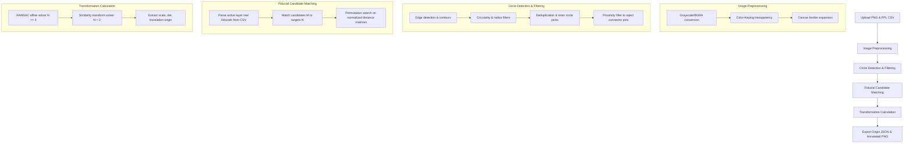

# PCBVisor Project Overview

PCBVisor is a Streamlit-based computer vision application designed to align physical PCB coordinate spaces with digital raster images. It automates **PCB Fiducial Detection and Board Alignment**, allowing downstream systems to translate between real-world physical coordinates (in millimeters) and digital image coordinates (in pixels).

---

## 1. Project Purpose

When interacting with a physical printed circuit board (PCB) using a camera or robotic tool, coordinate alignment is required. Design files (such as Gerber files or Pick-and-Place coordinates) use a millimeter-based Cartesian coordinate system relative to a board origin $(0,0)$. The camera, however, works in pixel coordinates $(x, y)$.

PCBVisor acts as a **black-box alignment engine** that:
1. Detects circular alignment markers (fiducials) on the PCB image.
2. Parses the design coordinates of these fiducials from a Pick-and-Place List (PPL) CSV.
3. Finds the optimal matching between detected pixels and design coordinates.
4. Computes a 2D Transformation Matrix (Similarity or Affine) that maps physical coordinates $(x_{mm}, y_{mm}) \rightarrow (x_{px}, y_{px})$, supporting board rotation, translation, scaling, and reflection (for mirrored/bottom layers).
5. Exports the calculated transformation mapping, the resolved layer, and the pixel location of the physical board origin.

---

## 2. Input Specifications

PCBVisor accepts two input files:

### A. PCB Image (`.png`)
* **Format:** Portable Network Graphics (`.png`).
* **Content:** Top-down, high-resolution color or grayscale photo/render of the PCB.
* **Pre-processing:** The system can perform color keying (making a specific background color transparent within a tolerance range) and border padding (expanding the canvas) to prevent edge clipping during coordinate mapping.

### B. Fiducial CSV (Pick-and-Place List - PPL)
* **Format:** Comma-Separated Values (`.csv`).
* **Metadata:** May contain header metadata rows (which the parser automatically skips until it finds the column header row).
* **Target Columns:** The CSV must contain the following columns (matched case-insensitively and in any column order):
  1. `Designator`: The component identifier. The parser only considers components starting with the prefix `FD` or `FID` (e.g., `FD1`, `FID_2`) as fiducials.
  2. `Layer`: The PCB side (e.g. `"TopLayer"`, `"BottomLayer"`, `"TOP"`, `"BOT"`). The system filters coordinates belonging to the active layer.
  3. `Center-X(mm)`: The physical X-coordinate in millimeters.
  4. `Center-Y(mm)`: The physical Y-coordinate in millimeters.

---

## 3. Coordinate Transformation Mathematics

The alignment engine computes a $2 \times 3$ affine/similarity transformation matrix $M$:

$$M = \begin{bmatrix} M_{00} & M_{01} & M_{02} \\ M_{10} & M_{11} & M_{12} \end{bmatrix}$$

This matrix maps physical board coordinates in millimeters $(x_{mm}, y_{mm}) \rightarrow (x_{px}, y_{px})$ using the following linear system:

$$x_{px} = M_{00} \cdot x_{mm} + M_{01} \cdot y_{mm} + M_{02}$$
$$y_{px} = M_{10} \cdot x_{mm} + M_{11} \cdot y_{mm} + M_{12}$$

### Key Properties Derived from Matrix $M$:

1. **Physical Origin (0,0) Mapping:**
   The translation components of the matrix directly represent the pixel coordinates of the physical board origin:
   $$x_{origin\_px} = M_{02}$$
   $$y_{origin\_px} = M_{12}$$

2. **Scaling Factor:**
   The pixel-to-millimeter ratio (resolution scale) of the board image can be extracted as:
   $$\text{scale} = \sqrt{M_{00}^2 + M_{10}^2} \quad (\text{pixels per mm})$$

3. **Mirroring (Reflection) Detection:**
   The determinant of the rotation-scaling submatrix indicates if the layout is mirrored (which happens when viewing the bottom layer of a board):
   $$\text{det} = M_{00} \cdot M_{11} - M_{01} \cdot M_{10}$$
   * If $\text{det} > 0$: Normal orientation (right-handed coordinate system).
   * If $\text{det} < 0$: Mirrored orientation (left-handed coordinate system).

---

## 4. Output Specifications

The system produces two primary categories of outputs: data payloads (JSON) and visualization images (PNG).

### A. Origin and Transformation Data (`[BoardName]_origin.json`)
This is the **primary data output** consumed by external automation scripts or subsequent projects.

#### JSON Structure Example:
```json
{
    "transformation_matrix": [
        [41.523456, -0.123456, 1250.5],
        [0.123456, 41.523456, 980.25]
    ],
    "origin_pixel": {
        "x": 1251,
        "y": 980
    },
    "layer": "TOP",
    "matched_fiducials": [
        {
            "designator": "FD1",
            "x_px": 1458.12,
            "y_px": 974.05,
            "radius_px": 16.5
        },
        {
            "designator": "FD2",
            "x_px": 1250.5,
            "y_px": 2185.32,
            "radius_px": 16.3
        }
    ]
}
```

#### Field Descriptions:
* `transformation_matrix` *(2D array of floats)*: The calculated $2 \times 3$ affine transformation matrix mapping millimeters to pixels (rounded to 6 decimal places).
* `origin_pixel` *(object)*: The exact pixel location $(x, y)$ of the physical coordinate origin $(0,0)$ on the board, rounded to the nearest integer.
* `layer` *(string)*: The resolved active board layer (normalized to `"TOP"` or `"BOT"`).
* `matched_fiducials` *(array)*: List of fiducials matched between the design list and the image:
  * `designator` *(string)*: Name of the fiducial component (e.g. `"FD1"`).
  * `x_px` *(float)*: Center X-coordinate in pixels.
  * `y_px` *(float)*: Center Y-coordinate in pixels.
  * `radius_px` *(float)*: Measured radius of the fiducial circle in pixels.

---

## 5. Execution Pipeline (Black-Box Logic)

Under the hood, PCBVisor feeds the inputs through a modular image-processing and math pipeline:



1. **Preprocessing:** Standardizes the image to 4-channel BGRA, sets alpha to 0 for background colors within a tolerance, and adds transparent margins.
2. **Detection:** Finds circular shapes, filters candidates by radius range and circularity index, selects inner concentric circles, and runs a proximity filter along axes to discard repeating patterns (like connector pin headers).
3. **Matching:** Maps the $M$ detected pixel candidates to the $N$ design fiducials on the target layer. It evaluates matching permutations using distance-matrix comparison (handling exact matches, 2-fiducial scale-constrained pairs, and 3+ fiducial distance-ratio checks).
4. **Solver:** Computes $M$ using an affine solver (with RANSAC if $N \ge 3$) or a similarity solver (if $N = 2$), detecting mirroring automatically.
5. **Exporter:** Calculates the world origin position $(0,0)$ in pixel coordinates and writes the `_origin.json` payload, along with drawing visually annotated images showing coordinate axes and markers.
